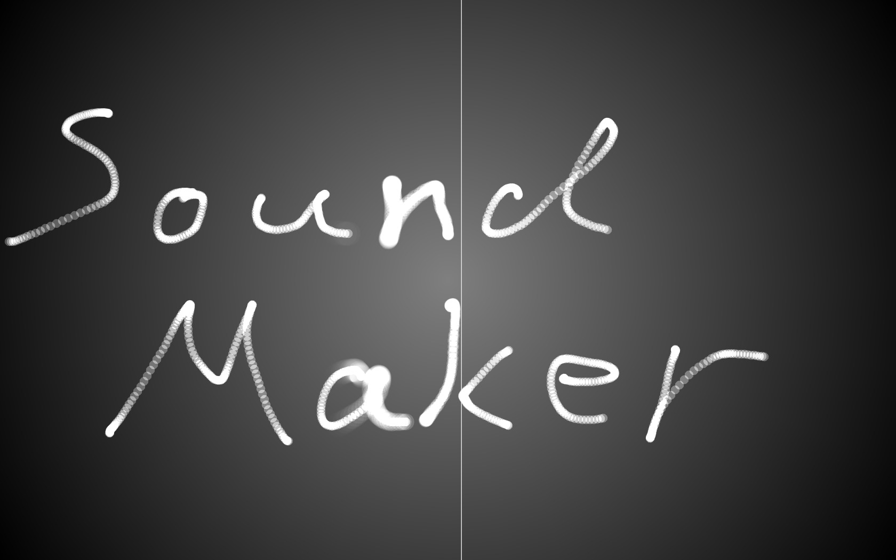

It will play picture that drawn by you as music.

## Usage
- mouse left button

	Draw picture.

- mouse right button

	Erase picture.

- space bar

	Erase all picture.

- up key / down key

	Change paly speed.

- escape key

	Close program.

## License
[MIT License](https://opensource.org/licenses/MIT) (c)2016 [MacRat](http://blanktar.jp)
